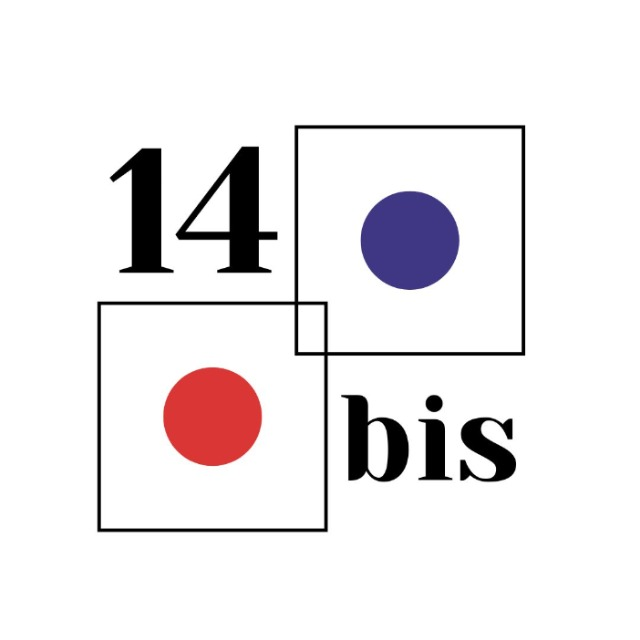
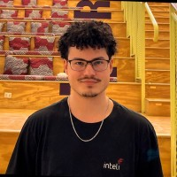

# 2025-1B-T12-EC06-G04

# Inteli - Instituto de Tecnologia e Liderança


##  14 - Bis

<div align="center">
<br>
</div>

## 👥 Grupo 2 - Integrantes:

<div align="center">
<table>
<tr>
<td align="center">
<a href="https://www.linkedin.com/in/Gustavo-daCosta/">
<br>
<sub><b>Gustavo Gonçalves da Costa</b></sub>
</a>
</td>

<td align="center">
<a href="https://www.linkedin.com/in/laura-rodrigues31/">
<br>
<sub><b>Laura Rodrigues</b></sub>
</a>
</td>

<td align="center">
<a href="https://www.linkedin.com/in/kethlenmartins/">
<br>
<sub><b>Kethlen Martins</b></sub>
</a>
</td>

<td align="center">
<a href="https://www.linkedin.com/in/ian-pereira-simao/">
<br>
<sub><b>Ian Simão</b></sub>
</a>
</td>

<td align="center">
<a href="https://www.linkedin.com/in/lucas-periquito-costa/">
<br>
<sub><b>Lucas Periquito</b></sub>
</a>
</td>

<td align="center">
<a href="https://www.linkedin.com/in/joão-v-wandermurem/">
<br>
<sub><b>João Wandermurem</b></sub>
</a>
</td>

<td align="center">
<a href="https://www.linkedin.com/in/rafaela-s-o-lima/">
<br>
<sub><b>Rafaela Silva</b></sub>
</a>
</td>

<td align="center">
<a href="https://www.linkedin.com/in/davioliveiraferreira/">
<br>
<sub><b>Davi Ferreira</b></sub>
</a>
</td>
</tr>
</table>
</div>


## 👩‍🏫 Professores:

### Orientador(a) 
- [Rodrigo Nicola](https://www.linkedin.com/in/rodrigo-mangoni-nicola-537027158/)

### Instrutores
- [Lisane Valdo](https://www.linkedin.com/in/lisane-valdo/)
- [Guilherme Cestari](https://www.linkedin.com/in/gui-cestari/)
- [Geraldo Magela Severino Vasconcelos](https://www.linkedin.com/in/geraldo-magela-severino-vasconcelos-22b1b220/)
- [Murilo Zanini de Carvalho](https://www.linkedin.com/in/murilo-zanini-de-carvalho-0980415b/)
- [Filipe Gonçalves](https://www.linkedin.com/in/filipe-gon%C3%A7alves-08a55015b/)

## 📜 Descrição

O projeto desenvolvido pelo grupo 14 BIS tem como objetivo automatizar e otimizar o processo de análise de fissuras em edificações, uma demanda recorrente do Laboratório de Materiais para Produtos de Construção (LMPC) do IPT. Atualmente, a análise dessas fissuras é feita manualmente a partir de fotos coletadas em vistorias técnicas, tornando o processo repetitivo, sujeito a erros e demorado, já que exige revisão por múltiplos especialistas.

Nossa solução consiste em uma aplicação desktop, construída com Rust e Python, que utiliza inteligência artificial para identificar e classificar automaticamente fissuras em imagens, separando-as por fachada ou área da edificação com base nos metadados das fotos. O sistema organiza as imagens em uma estrutura de pastas alinhada ao fluxo de trabalho do LMPC, funciona totalmente offline e permite a geração automática de relatórios, além de possibilitar a revisão e reclassificação manual das imagens pelos usuários.

Com essa abordagem, buscamos reduzir o tempo e o esforço necessários para a análise técnica, aumentar a precisão dos diagnósticos e oferecer uma ferramenta prática, segura e adaptada à rotina dos profissionais do laboratório.
 
<br/>

# Inicialização da documentação no Docusaurus

Docusaurus é um gerador de sites estáticos criado pelo Facebook para documentação técnica. Permite publicar conteúdo facilmente, com navegação clara e responsiva.

Siga os passos abaixo para inicializar o servidor local da documentação do projeto utilizando Docusaurus:

## Pré-requisitos
* Node.js (versão recomendada: 18.x ou superior)
* npm 

Verifique se estão instalados corretamente executando:
```python
node -v
npm -v 
```
## Instalação das Dependências
No terminal, navegue até a pasta raiz da documentação e instale as dependências com o comando abaixo:

```python
npm install

```

# Executando a Documentação Localmente
Para executar o servidor local da documentação, utilize o comando:

```
npm run start
```

## Acessando a Documentação
Após inicializado, acesse a documentação abrindo seu navegador em:
```
http://localhost:3000
````

# Aplicação Desktop e modelo de classificação de imagens

Instruções para executar localmente a aplicação desktop e o modelo de classificação de imagens

## Pré-requisitos

Certifique-se de ter as seguintes ferramentas instaladas antes de iniciar a aplicação Desktop:

- **Rust**:  
    Instale o Rust utilizando o comando abaixo:  
    ```bash
    curl --proto '=https' --tlsv1.2 -sSf https://sh.rustup.rs | sh
    ```
    Após a instalação, reinicie o terminal e verifique com:
    ```bash
    rustc --version
    ```

- **Dioxus CLI**:  
    Instale o Dioxus CLI com:
    ```bash
    cargo install dioxus-cli
    ```

- **Python 3**:  
    Baixe e instale o Python 3 a partir de [python.org](https://www.python.org/downloads/).  
    Verifique a instalação:
    ```bash
    # Windows
    python --version

    # Linux
    python3 --version
    ```

## Guia de inicialização

Após a instalação de todos as tecnologias necessárias para executar o projeto, é possível seguir o passo-a-passo para executar.

Para executar a aplicação desktop desenvolvida com Dioxus, siga os passos abaixo:

1. Navegue até o diretório do projeto desktop:
    ```bash
    cd src/app-rust
    ```

2. Compile e execute a aplicação utilizando o Dioxus CLI:
    ```bash
    dx serve --platform desktop
    ```
    ou, para gerar o executável:
    ```bash
    dx build --platform desktop
    ./target/desktop/debug/app-rust
    ```

3. A interface gráfica será aberta automaticamente. Caso não abra, execute o binário gerado na pasta `target/desktop/debug`.

## 📋 Licença

 
<p xmlns:cc="http://creativecommons.org/ns#" xmlns:dct="http://purl.org/dc/terms/">
  <a property="dct:title" rel="cc:attributionURL" href="https://github.com/Inteli-College/2025-1A-T12-EC05-G02">14-Bis</a> 
  by 
  <a rel="cc:attributionURL dct:creator" property="cc:attributionName" href="https://www.inteli.edu.br/">Inteli</a>, 
  <a href="https://www.linkedin.com/in/Gustavo-daCosta/">Gustavo Gonçalves da Costa</a>, 
  <a href="https://www.linkedin.com/in/laura-rodrigues31/">Laura Rodrigues</a>, 
  <a href="https://www.linkedin.com/in/kethlenmartins/">Kethlen Martins</a>, 
  <a href="https://www.linkedin.com/in/ian-pereira-simao/">Ian Simão</a>, 
  <a href="https://www.linkedin.com/in/lucas-periquito-costa/">Lucas Periquito</a>, 
  <a href="https://www.linkedin.com/in/joão-v-wandermurem/">João Wandermurem</a>, 
  <a href="https://www.linkedin.com/in/rafaela-s-o-lima/">Rafaela Silva</a>, 
  <a href="https://www.linkedin.com/in/davioliveiraferreira/">Davi Ferreira</a>,  
  is licensed under 
  <a href="http://creativecommons.org/licenses/by/4.0/?ref=chooser-v1" target="_blank" rel="license noopener noreferrer" style="display:inline-block;">
    Attribution 4.0 International
  </a>
</p>
