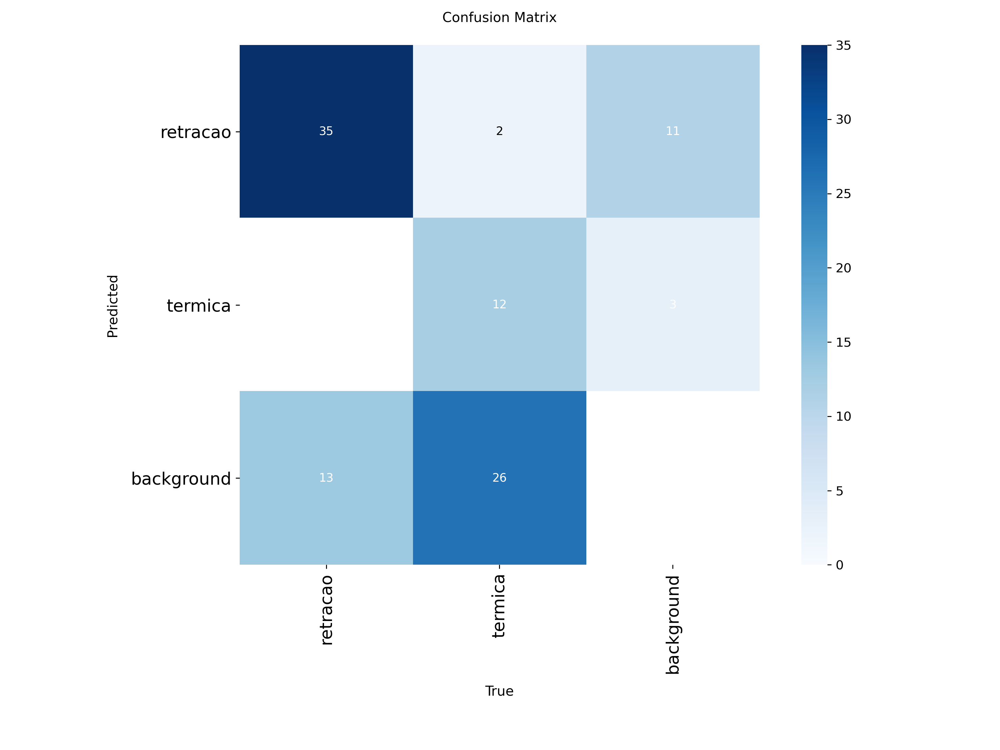
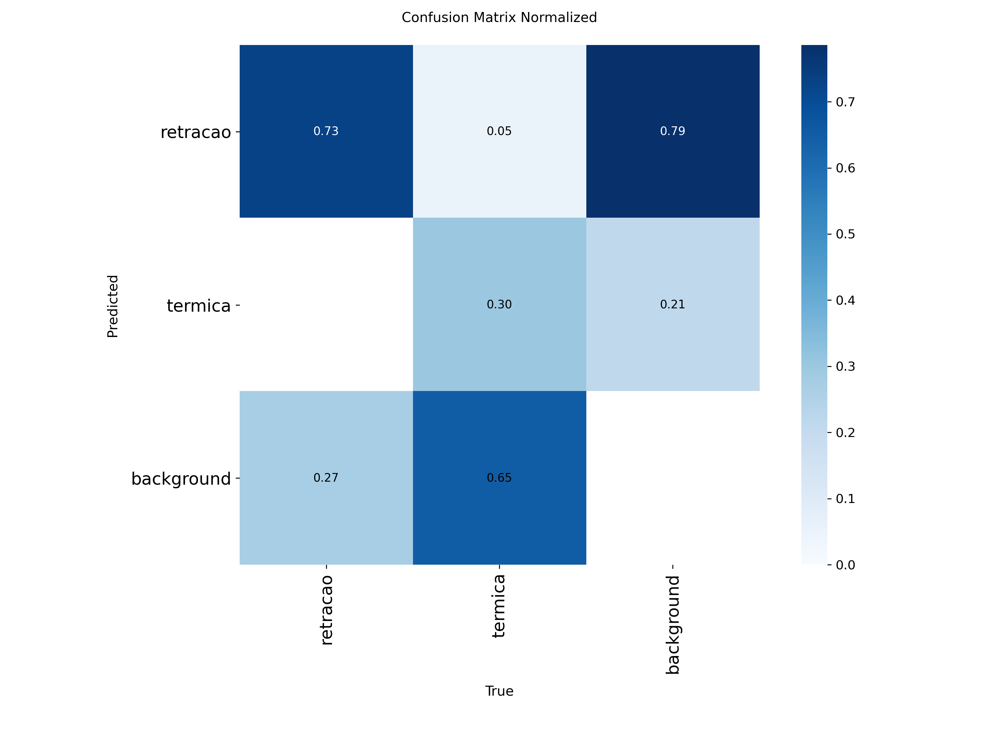
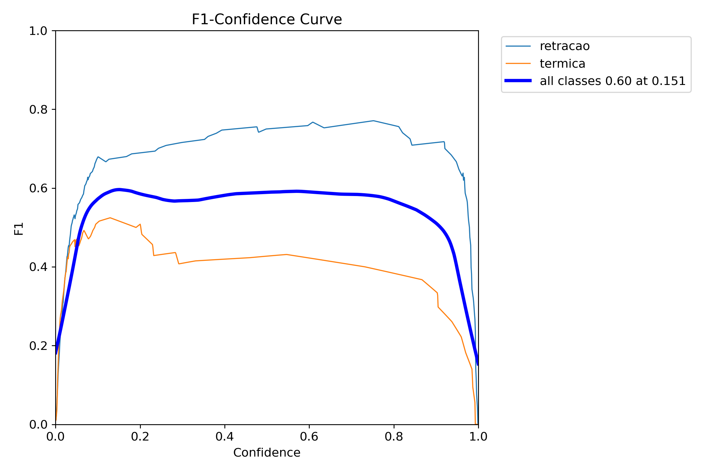
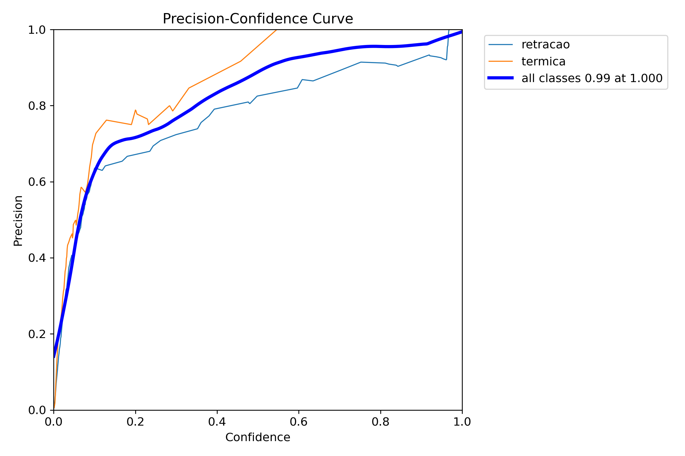
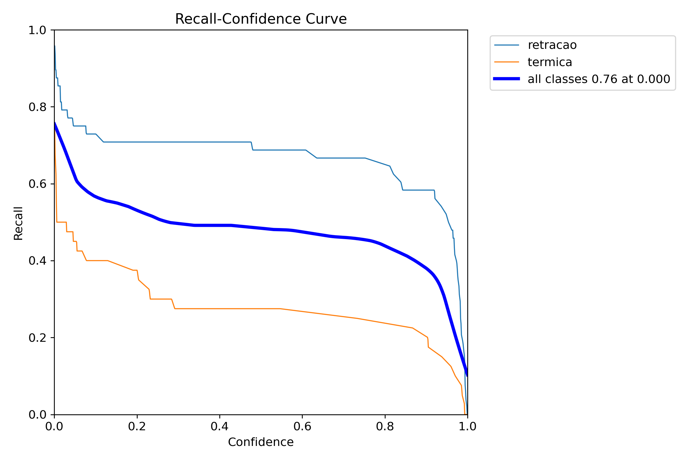
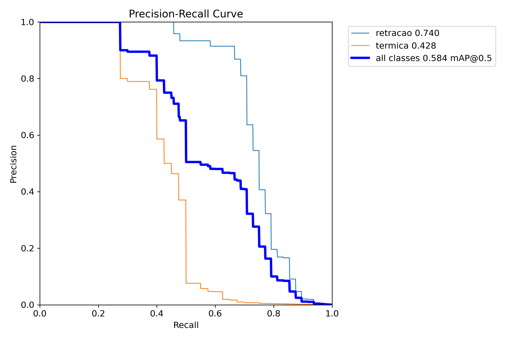

# Algoritmo de Detecção com YOLO

&emsp; Para identificar automaticamente fissuras em imagens de edificações, adotamos o algoritmo **YOLO** (You Only Look Once), uma das abordagens mais avançadas e eficientes em tarefas de detecção de objetos. Diferente dos classificadores tradicionais, que apenas indicam a presença de uma anomalia na imagem, o **YOLO** realiza localização e classificação simultâneas, fornecendo a posição exata das fissuras diretamente na imagem. Isso o torna especialmente útil para cenários como o do IPT, em que a precisão espacial das anomalias é tão importante quanto sua identificação.

&emsp;Antes de partirmos para a detecção, utilizamos o **YOLO** inicialmente em um modelo de classificação de imagens, treinado para diferenciar dois tipos específicos de fissuras: **fissuras por retração** e **fissuras térmicas**. Essa abordagem permitiu validar a viabilidade da aplicação de visão computacional no nosso contexto. O desempenho foi excelente: o modelo atingiu uma acurácia próxima de 100% nos testes, o que nos deu confiança para evoluir para a etapa seguinte — detecção com localização precisa.

&emsp; A escolha pelo **YOLO** se deve principalmente à sua velocidade e precisão, características que o tornam ideal para tanto para aplicações em tempo real quanto para aplicações offline, como é o caso do software que estamos desenvolvendo para os técnicos do LMPC/IPT. Sua arquitetura compacta e eficiente permite que o modelo funcione bem mesmo em dispositivos com recursos limitados.

&emsp; Para treinar o modelo de detecção, utilizamos imagens reais coletadas em vistorias e também tiradas de artigos publicados, anotadas manualmente com _bounding boxes_ ao redor das fissuras. Essas anotações indicam ao modelo exatamente onde estão as fissuras e a qual classe pertencem, permitindo que o **YOLO** aprenda a reconhecer padrões visuais sutis e específicos de cada tipo de patologia.

&emsp; Essa abordagem oferece um ganho significativo para a rotina de trabalho do LMPC: ao automatizar a identificação e categorização das fissuras diretamente nas imagens, o sistema reduz o tempo necessário para análise manual, melhora a padronização do diagnóstico e gera dados estruturados que podem ser armazenados, auditados e comparados ao longo do tempo.

## 1. Algoritmo de Detecção

&emsp; Nesta etapa do projeto, treinamos o modelo de detecção **YOLO** com duas classes: retracao e termica, correspondentes aos principais tipos de fissuras observados pelo LMPC/IPT. O foco foi permitir que o algoritmo não apenas identificasse a presença das anomalias, mas também as diferenciasse automaticamente conforme sua origem.

&emsp; As imagens utilizadas foram anotadas com a ferramenta LabelMe, e os contornos das fissuras foram desenhados manualmente para garantir maior precisão. As anotações, originalmente salvas em formato JSON, foram convertidas para o padrão YOLO através de um script desenvolvido pela equipe, descrito nos tópicos seguintes.

### 1.1. Organização de Pastas
* No nosso diretorio entre em: `src/Yolo/Yolo_Det`

&emsp; Neeste diretório temos a seguinte organização de pastas e arquivos principais:

```
YOLO/
├── YOLO_Det_py/
│   ├── Dataset/
│   │   ├── classes.txt
│   │   └── dataset.yaml
│   ├── RunDataset/
│   │   └── .gitignore
│   ├── runs/
│   │   └── detect/
│   │       ├── predict/
│   │       ├── predict2/
│   │       ├── predict3/
│   │       ├── val/
│   │       └── yolo_rachaduras/
│   ├── best.pt
│   ├── convertYolo.py
│   ├── resultados.json
│   ├── rodar_modelo_prod.py
│   ├── yolo_test.py
│   ├── yolo_train.py
│   ├── yolov8m.pt
│   └── yolov8n.pt
```
&emsp; Seguem aqui breve descrição das principais pastas e arquivos

* `Dataset/`: contém os arquivos de configuração do conjunto de dados.

    - `classes.txt`: lista das classes usadas (retracao, termica)

    - `dataset.yaml`: define estrutura e caminhos do dataset

* `RunDataset/`: pasta auxiliar para testes ou execuções temporárias

* `runs/detect/`: resultados gerados pelas execuções do modelo

    * `predict*/`: previsões feitas em diferentes execuções

    * ` val/`: validação durante o treinamento

    * `yolo_rachaduras/`: execução principal com as imagens anotadas

* `best.pt`: pesos finais do modelo com melhor desempenho

* `convertYolo.py`: script para converter anotações do LabelMe para YOLO

* `resultados.json`: armazena resultados após execução.

* `rodar_modelo_prod.py`: script principal de execução em produção

* `yolo_test.py`: script de testes rápidos

* `yolo_train.py`: script de treinamento do modelo

* `yolov8m.pt` e `yolov8n.pt`: pesos pré-treinados do YOLOv8 (médio e leve)

### 1.2. O Código

Nesta seção, apresentamos os principais scripts que compõem o pipeline de detecção de fissuras com YOLO. Cada etapa — desde a preparação dos dados até a execução do modelo — foi pensada para ser clara, modular e reaproveitável.

#### 1.2.1. Conversão de Anotações: 

&emsp; O script `convertYolo.py` converte as anotações feitas com o LabelMe (formato JSON) para o formato necessário pelo YOLO. Abaixo está um trecho central da função de conversão:

```
python
x_center = (x_min + x_max) / 2.0 / width
y_center = (y_min + y_max) / 2.0 / height
bbox_width = (x_max - x_min) / width
bbox_height = (y_max - y_min) / height
```
&emsp; O resultado do treinamento é salvo como `best.pt`, que contém os pesos do modelo com melhor desempenho.

#### 1.2.2. Execução e Geração de Resultados
&emsp; O script `rodar_modelo_prod.py` é usado para aplicar o modelo treinado em novas imagens. Ele gera como saída o arquivo `resultados.json`, com as fissuras detectadas em cada imagem e suas respectivas confianças:

````
"fissura": [
    { "name": "retracao", "confidence": 0.8269 },
    { "name": "retracao", "confidence": 0.4457 }
]

````

&emsp; Esse JSON é formatado automaticamente a partir das predições do modelo com:

```
results = model.predict(source=dir_path)
...
per_image[img_path]["fissura"].append({
    "name": label_to_name[int(cls)],
    "confidence": float(conf)
})

```

&emsp; Esse arquivo será o principal ponto de **integração** com o **aplicativo desktop**, que usará essas informações para exibir os resultados ao usuário final. Os detalhes dessa integração estão descritos em outro tópico deste documento.

#### 1.2.3.Validação

&emsp;Para fins de verificação rápida, `yolo_test.py` permite executar uma validação automática no modelo treinado: 
```
model = YOLO("best.pt")
model.val()

```

&emsp;Essa validação retorna métricas como precisão e recall, úteis para ajustes posteriores.

## 2. Resultados

&emsp; Após o treinamento, avaliamos o desempenho do modelo utilizando métricas clássicas de classificação, como precisão, revocação e F1-score, além de realizar análises visuais por meio de matrizes de confusão e curvas de desempenho por confiança que serão explicados a seguir:

### 2.1. Métricas Gerais

* **Precisão média (Precision):** 88,2%

&emsp;Esse valor indica que, na maioria das vezes, quando o modelo aponta a presença de uma fissura, ele está correto. Isso reflete um baixo número de falsos positivos, o que é desejável para manter a confiança nas detecções realizadas.

* **Revocação média (Recall):** 61,0%

&emsp; Aqui observamos que o modelo deixou de identificar algumas fissuras reais. Embora isso represente um desafio, é um ponto já identificado e que será tratado com melhorias nas próximas sprints, especialmente com ajustes na arquitetura e estratégias de balanceamento de dados.

* **F1-score médio:** 70,9%

&emsp; Esse índice representa o equilíbrio entre precisão e revocação. O resultado é satisfatório considerando o tamanho do dataset e a resolução das imagens (224x224), e será usado como base para otimizações nos próximos ajustes. 

### 2.2. Métricas por Classe
| Classe    | Precisão | Revocação |
|-----------|----------|-----------|
| Retração | 92%      | 65%       |
| Térmica   | 84%      | 57%       |

&emsp; Esses valores sugerem que o modelo está performando melhor na detecção de fissuras do tipo **retração**, tanto em termos de precisão quanto de revocação. Já a detecção de **fissuras térmicas** apresenta um pouco mais de variabilidade, o que também será foco de atenção na próxima sprint.

### 2.3. Interpretação dos Resultados
&emsp; De forma geral, os resultados são positivos. O modelo se mostrou confiável ao detectar fissuras — especialmente do tipo **retração** — e tem um desempenho razoavel em relação ao equilíbrio entre precisão e revocação.

&emsp; Entretanto, foi identificado que fissuras mais discretas, especialmente do tipo térmica, tendem a ser menos detectadas. Acredita-se que isso se deva à resolução relativamente baixa das imagens e à similaridade visual com o fundo. Já estamos planejando ajustes na base de dados e no pipeline de treinamento para abordar esse ponto.

### 2.4 Análise Visual dos Graficos e Matrizes
&emsp;A análise visual dos resultados permite compreender de forma mais intuitiva como o modelo se comporta em diferentes situações, complementando os números apresentados anteriormente. A seguir, detalhamos cada gráfico gerado na avaliação do modelo:

#### 2.4.1 Matriz de Confusão (valores absolutos)

&emsp;Esta matriz representa, em números absolutos, quantas amostras de cada classe foram corretamente classificadas ou confundidas com outra. As **linhas representam a classe real **da imagem, e as **colunas representam a predição** feita pelo modelo.

<div align="center">

  <sub>Figura 1 -  Matriz de Confusão (valores absolutos) </sub>

  

  <sup>Fonte: Material produzido pelo resultado do algoritmo (2025).</sup>

</div>

**Como interpretar:**
* O valor na diagonal (ex: linha “retracao”, coluna “retracao”) indica acertos.

* Os valores fora da diagonal mostram os erros de classificação.

**Nossa interpretação:**

&emsp; Apesar do número de acertos ser bom, observamos que algumas fissuras reais não estão sendo detectadas, especialmente da classe “retracao”. Esse padrão reforça a necessidade de aumentar a representatividade das fissuras menores ou menos contrastantes no dataset, algo que planejamos abordar na próxima sprint com aumento de dados (data augmentation) e ajustes no pré-processamento.


#### 2.4.2 Matriz de Confusão Normalizada

&emsp; Essa matriz mostra as proporções de acertos e erros para cada classe, permitindo avaliar o desempenho independentemente da quantidade de amostras.

<div align="center">

  <sub>Figura 2 -  Matriz de Confusão Normalizada </sub>

  

  <sup>Fonte: Material produzido pelo resultado do algoritmo (2025).</sup>

</div>

**Como interpretar:**
* Um valor de 73% na linha “retracao” e coluna “retracao” indica que, ao receber imagens reais da classe “retracao”, o modelo acerta essa classe em 73% dos casos.

*  A classe “background” apresentou maior confusão, sendo por vezes classificada como uma fissura.


#### 2.4.3 Curva F1 vs Confiança

&emsp; Essa curva mostra como o F1-score varia conforme o limiar de confiança utilizado para aceitar uma predição como válida.

<div align="center">

  <sub>Figura 3 -  Curva F1 vs Confiança </sub>

  

  <sup>Fonte: Material produzido pelo resultado do algoritmo (2025).</sup>

</div>

**Nossa interpretação:**

* O ponto ótimo está em torno de confiança = 0.151, com F1 médio ≈ 0.60.

* A classe “retracao” mantém desempenho consistente.

* A classe “térmica” apresenta instabilidade, sugerindo maior dificuldade de identificação.

&emsp; O modelo demonstra boa performance em cenários mais conservadores (com confiança moderada). A oscilação no F1 da classe “térmica” indica que o modelo ainda tem dificuldade em consolidar uma representação robusta para esse tipo de fissura. Estamos considerando refinar o balanceamento de classes e aplicar técnicas de _oversampling_ específico para térmicas.


#### 2.4.4. Curva de Precisão vs Confiança

&emsp; Essa curva ilustra a relação entre precisão e o nível de confiança exigido para uma predição.

<div align="center">

  <sub>Figura 4 - Curva de Precisão vs Confiança </sub>

  

  <sup>Fonte: Material produzido pelo resultado do algoritmo (2025).</sup>

</div>

**Como interpretar:**
* Limiares mais altos reduzem o número de predições, mas aumentam a precisão — o modelo erra menos quando tem mais certeza.


**Nossa interpretação:**
&emsp;O modelo mostra **comportamento conservador positivo**: quando ele tem alta confiança, geralmente está certo. Isso nos dá margem para implementar **filtros por confiança mínima** no sistema final, minimizando falsos positivos.

#### 2.4.5. Curva de Revocação vs Confiança

&emsp; Esta curva mostra como a capacidade do modelo de encontrar todas as fissuras reais (revocação) muda conforme o limiar de confiança.

<div align="center">

  <sub>Figura 5 - R_curve.png Curva de Revocação vs Confiança </sub>

  

  <sup>Fonte: Material produzido pelo resultado do algoritmo (2025).</sup>

</div>

**Como interpretar:**
* Limiares baixos aumentam a revocação, mas podem vir com mais erros (falsos positivos)


**Nossa interpretação:**
&emsp; A curva revela que o modelo sacrifica revocação ao buscar precisão alta. Ainda estamos decidindo como tratar sobre esses números.

#### 2.4.6. Curva de Precisão vs Revocação (PR Curve)

&emsp;

<div align="center">

  <sub>Figura 6 - Curva de Precisão vs Revocação (PR Curve) </sub>

  

  <sup>Fonte: Material produzido pelo resultado do algoritmo (2025).</sup>

</div>

**Nossa interpretação:**

* A curva da classe “retracao” é mais estável e próxima ao ideal.

* A curva da classe “térmica” mostra oscilações, o que reforça a dificuldade já observada.

## 3. Conclusão
 
&emsp; Os resultados desta etapa mostram que o modelo já apresenta um desempenho promissor em termos de precisão, o que é importante para garantir que as detecções feitas sejam confiáveis. Esse comportamento indica que o modelo raramente comete falsos positivos — um aspecto desejável, especialmente em contextos onde decisões críticas são tomadas com base nas predições.

&emsp;Entretanto, observamos que a revocação ainda está abaixo do ideal, o que significa que o modelo não identifica todas as fissuras presentes, especialmente no caso de fissuras mais sutis ou com menor contraste visual. Esse ponto é especialmente relevante para a classe “térmica”, que possui características visuais mais difíceis de detectar. Essa limitação impacta diretamente na cobertura da solução, ou seja, na sua capacidade de flagrar todos os casos relevantes.

&emsp; Fica evidente que a classe “retracao” está mais bem representada e aprendida pelo modelo. A classe “térmica”, por outro lado, precisa de atenção especial na curadoria e enriquecimento do dataset, além de talvez exigir features especializadas para capturar suas características visuais mais discretas. Vamos tratar isso como prioridade na próxima sprint.

&emsp; Apesar desses desafios, os _insights_ obtidos nesta análise são extremamente valiosos e já embasam ações objetivas de melhoria para a próxima iteração. Com ajustes direcionados no dataset, no pré-processamento e na arquitetura, temos confiança de que o modelo pode alcançar mwlhores resultados.