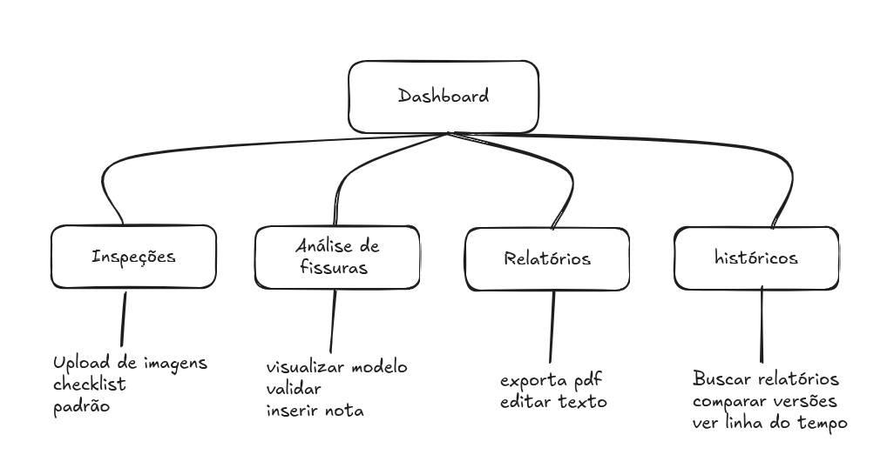

# Arquitetura da informação

## Introdução

&emsp; A Arquitetura da Informação é a disciplina que organiza e estrutura os conteúdos, funcionalidades e fluxos de interação de um sistema, de forma que a navegação seja intuitiva, eficiente e atenda às necessidades dos usuários finais. Ela visa garantir que as informações corretas estejam disponíveis no momento certo, da maneira mais clara e acessível possível, reduzindo a complexidade cognitiva e aumentando a eficiência nas operações.

No contexto geral de projetos de sistemas interativos, a arquitetura da informação é fundamental para:

- Facilitar a localização de informações e o acesso a funcionalidades críticas;

- Apoiar a experiência do usuário (UX), promovendo jornadas fluidas e satisfatórias;

- Garantir que a estrutura do sistema esteja alinhada com as dores, desejos e objetivos dos usuários.

&emsp;Dessa forma, uma arquitetura da informação bem definida não apenas melhora a usabilidade do sistema, mas também contribui diretamente para sua eficácia e para o sucesso do projeto como um todo.

## Desenvolvimento

&emsp;Neste projeto, o sistema proposto tem como objetivo possibilitar a captura remota de imagens de fissuras em edificações, o processamento automatizado dessas imagens com técnicas de visão computacional e a geração de relatórios técnicos estruturados.

- Captura de imagens com drone e armazenamento em SD card;

- Processamento de imagem e classificação automatizada (IA);

- Visualização, validação e geração de relatórios técnicos por meio de uma aplicação acessada por especialistas.

Esse sistema atende dois usuários principais:

Jonathan Medeiros – Técnico de campo, responsável por inspecionar fisicamente as fachadas, capturar imagens padronizadas das fissuras e enviá-las para o sistema.

Ana Clara Santos – Pesquisadora e analista, responsável por revisar os resultados do modelo de classificação de fissuras e gerar relatórios técnicos validados.

| Seção Principal             | Funcionalidades incluídas                                       | Persona Beneficiada       |
|----------------------------|------------------------------------------------------------------|----------------------------|
| **Dashboard**              | Visão geral do sistema, status de inspeções e atalhos rápidos    | Ambos                      |
| **Inspeções**              | Checklist de captura, upload de imagens, orientações técnicas    | Jonathan Medeiros          |
| **Análise de Fissuras**    | Visualização das imagens, validação da IA, comentários técnicos  | Ana Clara Santos           |
| **Geração de Relatórios**  | Edição e exportação de relatórios técnicos                       | Ana Clara Santos           |
| **Histórico de Inspeções** | Acesso e comparação de relatórios anteriores                     | Ambos                      |
| **Configurações**          | Ajustes de parâmetros da IA, permissões e preferências           | Ana Clara Santos (admin)   |

## Diagrama de Relação (Mapa de Navegação)

A estrutura da interface segue uma lógica de menus principais com acesso direto às tarefas mais frequentes de cada persona.

Figura 1 - Diagramas de Sequência (Fluxos de Interação)

Fonte: autoria própria

### Fluxo de Jonathan – Captura e envio

→ Acessa Dashboard

→ Vai para "Inspeções"

→ Visualiza checklist de captura

→ Tira fotos conforme padrão

→ Faz upload das imagens

→ Recebe confirmação de envio

### Fluxo de Ana Clara – Análise e relatório

→ Acessa Dashboard

→ Vai para "Análise de Fissuras"

→ Visualiza imagens enviadas

→ Confere e edita resultados do modelo de classificação

→ Vai para "Geração de Relatórios"

→ Preenche observações técnicas

→ Exporta relatório

→ Relatório salvo no Histórico

## Conclusão
&emsp;A arquitetura da informação proposta busca otimizar a experiência dos dois perfis de usuários-chave do sistema, garantindo que cada funcionalidade esteja claramente posicionada e acessível conforme o fluxo de trabalho real. Ao guiar a navegação com base em tarefas típicas de inspeção e análise técnica, reduzimos a curva de aprendizado e aceleramos a operação do sistema em campo e em laboratório.

&emsp;Para Jonathan, o sistema atua como um guia de campo digital, oferecendo instruções claras e garantindo a padronização dos dados enviados. Para Ana Clara, o sistema se comporta como uma plataforma de análise e validação assistida por IA, oferecendo automação sem comprometer o rigor técnico da análise.

&emsp;A clareza na estrutura e o alinhamento com as personas proporcionam eficiência operacional, maior qualidade nos dados coletados e confiabilidade nos relatórios gerados, contribuindo diretamente para o propósito central do projeto: tornar o monitoramento de fissuras em edificações mais preciso, seguro e automatizado.