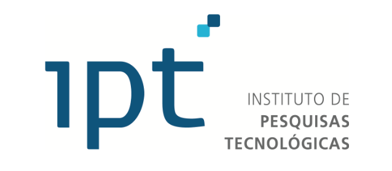
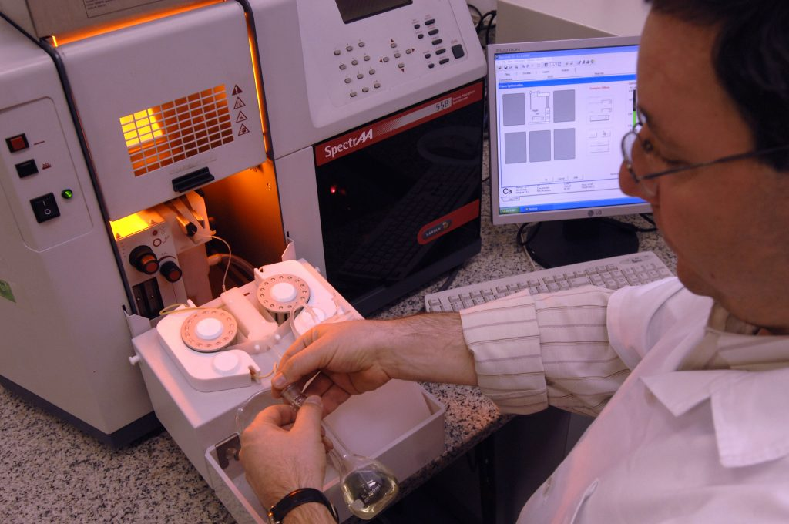

#  Introdução e Contextualização do Projeto
&emsp; O Inteli (Instituto de Tecnologia e Liderança) é uma faculdade que adota uma metodologia baseada em projetos reais, desenvolvidos em parceria com o mercado. Seguindo o modelo ágil, os projetos são divididos em cinco sprints ao longo de 10 semanas, com entregas contínuas e validações junto aos parceiros. Esta documentação refere-se ao projeto do Módulo 6 do curso de Engenharia da Computação - Realizado de Abril a Junho de 2025 pela Turma de 2027.
## 1. O Parceiro
&emsp; O parceiro deste projeto é o IPT (Instituto de Pesquisas Tecnológicas), especificamente na área do Laboratório de Materiais para Produtos de Construção (LMPC).

###  1.1. O IPT
&emsp;  O Instituto de Pesquisas Tecnológicas (IPT) é um dos maiores centros de pesquisa aplicada do Brasil, vinculado ao Governo do Estado de São Paulo.  

  Figura 1 - Logo do IPT 

  

  Fonte: [IPT](https://ipt.br/)

&emsp;Sua missão é promover inovação e desenvolvimento tecnológico por meio de serviços de pesquisa, ensaios laboratoriais, consultorias e apoio técnico para empresas, indústrias e instituições públicas, contribuindo para o avanço da ciência e da competitividade no país

#### 1.1.1. Laboratório de Materiais para Produtos de Construção

&emsp;  O Laboratório de Materiais para Produtos de Construção (LMPC) é uma das unidades técnicas do IPT voltadas à pesquisa, desenvolvimento e prestação de serviços especializados no setor da construção civil. O LMPC atua na caracterização de materiais de construção, avaliação de desempenho de sistemas construtivos e na investigação de patologias em edificações, como fissuras, infiltrações e degradações de revestimentos.

  Figura 2 - LMPC 

  

  Fonte: [IPT](https://ipt.br/2023/09/05/laboratorio-de-materiais-para-produtos-de-construcao/)

&emsp; Uma das atividades de destaque do laboratório é a realização de consultorias técnicas relacionadas a fissuras em construções, um problema comum e muitas vezes crítico, que pode comprometer a durabilidade, a segurança e a estética das edificações. Nessas consultorias, o LMPC realiza visitas técnicas, coleta de dados em campo, análise laboratorial de amostras e emissão de laudos detalhados com diagnóstico das causas e recomendações técnicas para correção. Essas análises são fundamentais para orientar reformas, garantir conformidade com normas técnicas e evitar danos estruturais mais graves.

&emsp; Com uma equipe multidisciplinar e infraestrutura laboratorial avançada, o LMPC contribui diretamente para a qualidade, segurança e inovação na construção civil brasileira, apoiando tanto órgãos públicos quanto empresas privadas na resolução de problemas e na melhoria contínua dos processos construtivos.

## 2. Problema
&emsp; A equipe do LMPC do IPT, no início da primeira sprint, nos trouxe um problema que enfrentam com frequência durante as vistorias em edificações. Para analisar fissuras em estruturas, são realizadas diversas visitas técnicas, nas quais uma grande quantidade de fotos é tirada para documentar cada anomalia observada. No entanto, todo esse material precisa ser analisado manualmente por um técnico, que deve categorizar fissura por fissura — identificando o tipo, a gravidade e a localização exata dentro da edificação.

&emsp;  Esse processo é extremamente repetitivo e desgastante, o que aumenta o risco de erros por fadiga e diminui a eficiência da análise. Além disso, como o diagnóstico correto depende da precisão dessas informações, o trabalho precisa ser revisado por até cinco pessoas diferentes antes que um laudo final possa ser emitido. Isso torna o processo lento ecustoso, especialmente quando há grande demanda por vistorias.

## 3. A Solução
&emsp;   Como resposta ao problema apresentado, nos do grupo **14 BIS** estamos desenvolvendo uma aplicação desktop, construída com Rust e Python, que alia desempenho, confiabilidade e praticidade. A solução utiliza inteligência artificial para analisar automaticamente as fotos coletadas durante as vistorias, identificando e classificando fissuras conforme seu tipo e características. Além disso, com base nos metadados das imagens, o sistema realiza a separação automática das fotos por fachada ou área da edificação, organizando-as em uma estrutura de pastas familiar ao fluxo de trabalho atual da equipe técnica.

&emsp;Um diferencial importante é que o aplicativo funciona totalmente offline, garantindo segurança, mobilidade e independência de conexão com a internet — ideal para uso em campo ou em ambientes com restrição de rede. A escolha por um software desktop também visa oferecer maior controle local sobre os dados e uma experiência mais fluida para os técnicos do LMPC.

&emsp; A aplicação também gera automaticamente um relatório padrão com as imagens classificadas e sugestões de análise, que pode ser exportado e modificado conforme necessário. Além disso, os usuários terão acesso a uma galeria visual por projeto, onde poderão revisar as imagens já classificadas. Caso identifiquem algum erro na categorização, poderão reclassificar manualmente com apenas um clique, e um novo relatório será gerado refletindo essa correção.

&emsp; Com essa solução, buscamos não apenas automatizar um processo repetitivo e suscetível a erros, mas também entregar uma ferramenta alinhada à rotina do LMPC, que otimize tempo, melhore a acurácia das análises e aumente a produtividade da equipe técnica.

## 4. Objetivo da Documentação

&emsp; Esta documentação tem como principal objetivo registrar de forma detalhada todas as etapas do desenvolvimento do projeto, incluindo o problema abordado, a proposta de solução, as decisões técnicas, os testes realizados e os resultados obtidos. Ela serve como um material de referência que permite acompanhar a evolução do trabalho e compreender as motivações e justificativas por trás de cada escolha feita pela equipe.

&emsp;  Além disso, a documentação também tem um papel importante no processo de avaliação por parte do orientador acadêmico, garantindo transparência e organização ao longo das entregas. Caso o projeto avance em parceria com o IPT, este material servirá como base para que a equipe técnica do instituto possa entender o funcionamento da solução, sua arquitetura e seus caminhos de melhoria ou continuidade, facilitando futuras integrações ou implementações.

&emsp; É importante ressaltar que, por adotarmos o modelo Scrum, nossa documentação está organizada em pastas cronológicas, divididas por sprints, facilitando o acompanhamento do progresso e a localização das informações de forma clara e estruturada.

