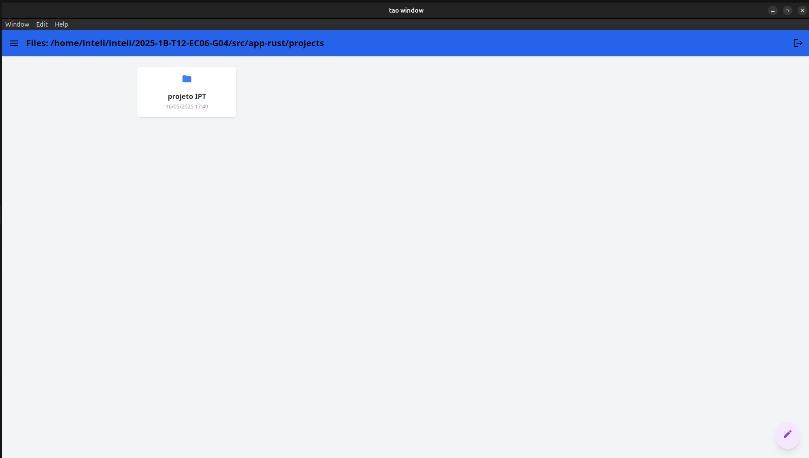
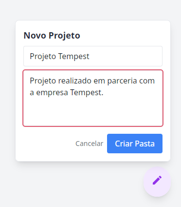

# Introdução

&emsp;Na Sprint 2, a equipe de desenvolvimento decidiu por utilizar o framework Dioxus para a criação de um aplicativo desktop, o qual executará a aplicação localmente. Tendo essa perspectiva em vista, foi desenvolvida a feature para criação das pastas de projetos. A seguir, o fluxo é explicado:

## Fluxo de criação de pastas

&emsp;Cada pasta criada é um projeto, contendo as imagens a serem classificadas, as imagens já classificadas e o relatório gerado. Assim, foi delimitado o seguinte fluxo:

1. Na página inicial, o usuário consegue encontrar todos os projetos (pastas) criados previamente e criar novos projetos. A página inicial será uma abstração de uma pasta root, da qual poderão ser acessadas todas as pastas de projetos.

Figura X - Tela inicial

Fonte: autoria própria

2. O usuário cria um novo projeto com nome e descrição. Ao finalizar essa etapa, uma nova pasta aparece na tela inicial e no diretório de arquivos dentro da pasta "root" projects.

Figura X - enu de criação de projetos

Fonte: autoria própria

3. O usuário consegue entrar e sair de quaisquer pastas que criar.

## Pontos de melhoria a serem implementados na próxima sprint

&emsp;Abaixo estão descritos os pontos de melhoria da feature que estão no Sprint Backlog da Sprint 3.

- Upload de imagens ao criar uma pasta: por dificuldades em orquestrar todas as versões de dependências do Dioxus, ainda não foi possível criar uma pasta e, concomitantemente, realizar o upload das fotos que serão classificadas pelo modelo.
- Navegação facilitada pelo elemento de path: atualmente, a navegação para sair das páginas acontece por um único botão, mas é intuitivo navegar pelo elemento que mostra o path, como já ocorre em outros sistemas de pasta como o Google Drive.
- Display da descrição do projeto: atualmente, a descrição do projeto se torna um documento txt dentro da pasta. É esperado que, ao entrar na pasta, essa descrição esteja como um elemento de texto visível, enão como um arquivo.

# Conclusão

&emsp;Com a implementação da feature de criação de pastas, o aplicativo tem a sua macro organização pronta e a equipe poderá começar a implementar estruturas e lógicas mais complexas dentro dos projetos criados pelo usuário. Além disso, a estrutura organizacional em pastas foi mantida, conforme as aplicações já utilizadas por usuários finais e personas, a fim de manter a familiaridade e boa experiência do usuário com a plataforma.