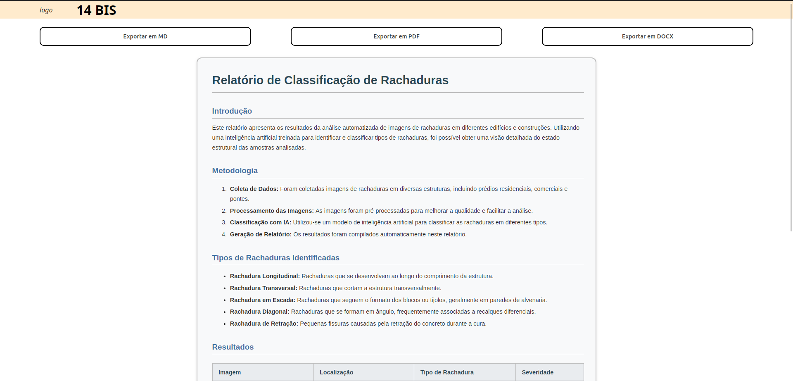

# Introdução

&emsp;&emsp;Durante a sprint 2, foi decidido por utilizar a linguagem de programação Rust junto ao framework Dioxus para desenvolvimento de um aplicativo desktop. Sendo assim, ao analisar as funcionalidades que deveriam estar presentes para ter um sistema completo, surge a necessidade de uma página para visualizar e exportar os relatórios.

## Visualização do relatório

&emsp;&emsp;Na tela de visualização do relatório, é possível visualizar o relatório do projeto selecionado. Além disso, é possível exportar o relatório em três formatos de arquivo diferentes, sendo eles, Markdown, PDF e Docx.

> **Imagem da tela de visualizar relatório**

Figura X - Página de visualização do relatório

Fonte: autoria própria

> **GIF da tela de visualizar relatório, demonstrando a navegação da tela**

Figura X - GIF da navegação da página de visualização do relatório

Fonte: autoria própria

## Exportar relatório

&emsp;&emsp;Na tela de visualização de relatório, uma das funcionalidades presentes é a opção de exportar o relatório. E visando garantir melhor flexibilidade conforme a situação e necessidades, é possível exportar o relatório em três tipos de arquivo, sendo eles, Markdown, PDF e Docx.

- **Markdown:** <a href="../../../static/documents/Relatorio.md" download>Exemplo de relatório em Markdown</a>

- **PDF:** [Exemplo de relatório em PDF](../../../static/documents/Relatorio.pdf)

- **Docx:** [Exemplo de relatório em Docx](../../../static/documents/Relatorio.docx)

Por fim, é válido mencionar, que por padrão o relatório fica armazenado no computador no formato Markdown, e quando o usuário decide exportar o arquivo através dessa página para outro formato que não seja Markdown, o sistema converte o arquivo para PDF ou Docx.

## Pontos de melhoria a serem implementados na próxima sprint

&emsp;&emsp;Para a próxima sprint, existe uma variedade de funcionalidades que devem ser implementadas, como:

- **Geração de relatórios:** No momento, um template de relatório é utilizado para todos os projetos. Para a próxima sprint, o objetivo é desenvolver um gerador automático de relatórios, considerando as imagens, dados e peculiaridades de cada projeto.

- **Alteração no template:** O template de relatório atual foi criado com base em modelos de relatórios genéricos. Para a próxima sprint, o ideal é ter acesso ao template de relatório utilizado pelo parceiro, e adaptar o nosso modelo conforme o deles.

# Conclusão

&emsp;&emsp;A funcionalidade de visualização de relatórios permite que o usuário revise o conteúdo gerado e, caso necessário, realize ajustes exportando o relatório em formatos editáveis, como Markdown e Docx. Além disso, a opção de exportação em PDF facilita a visualização e o compartilhamento do documento, tornando o processo mais flexível e acessível conforme as necessidades do usuário.
