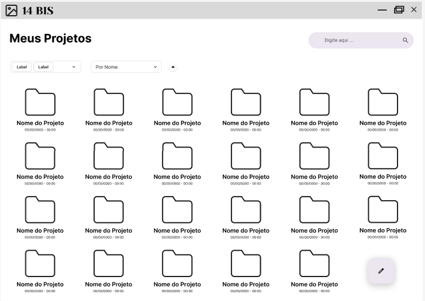
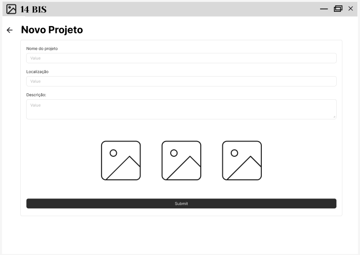
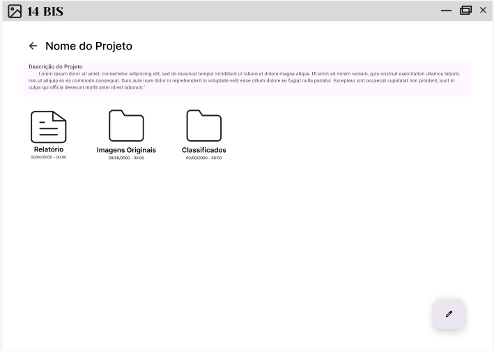
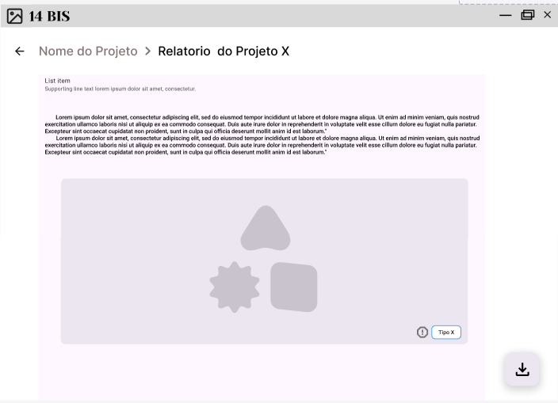
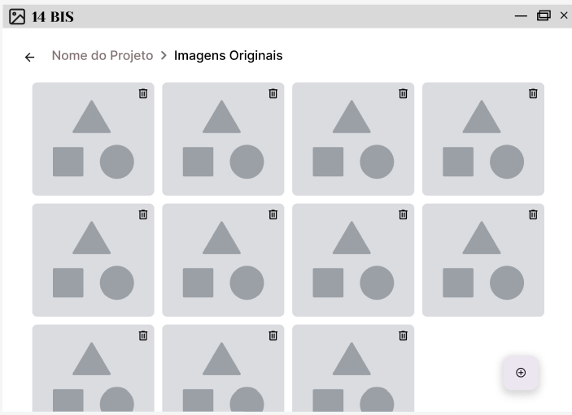
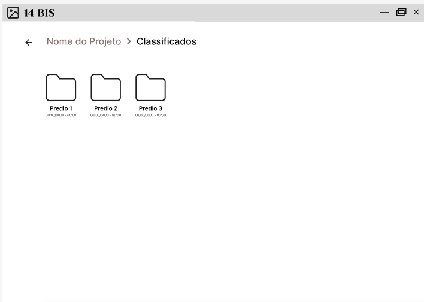
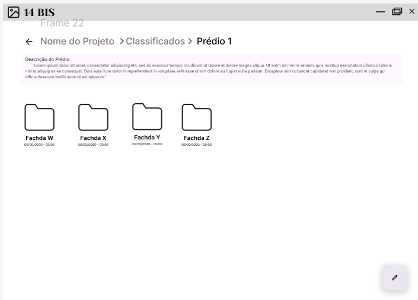
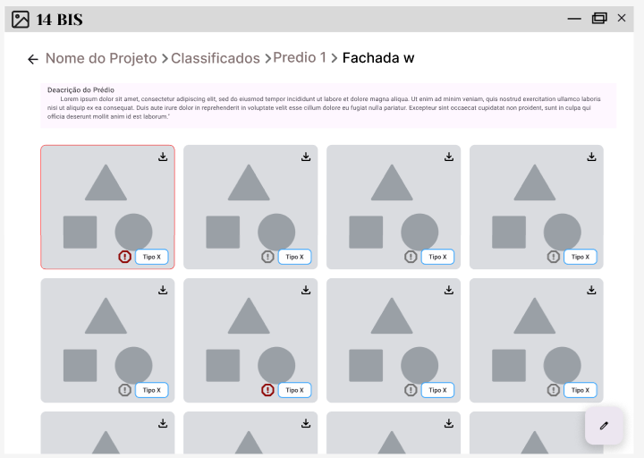
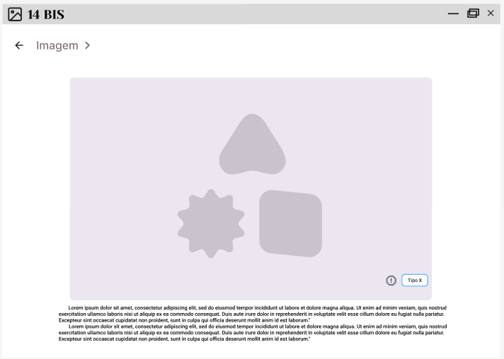

# Wireframe

## 1. Introdução

&emsp; Um **wireframe** é um esboço visual que representa a estrutura básica de uma página de site ou aplicativo. Ele funciona como um mapa que ajuda designers e desenvolvedores a organizarem os elementos da interface antes de se preocuparem com detalhes como cores e imagens.

&emsp; Fazer um **wireframe** visa reforçar e estruturar os seguintes aspectos do projeto:

- **Planejamento:** Define a disposição dos elementos, como botões, imagens e textos.
- **Usabilidade:** Ajuda a visualizar a experiência do usuário e garantir uma navegação intuitiva.
- **Comunicação:** Facilita o entendimento entre equipes de design e desenvolvimento.
- **Eficiência:** Permite ajustes antes da implementação, economizando tempo e recursos.

&emsp; Neste projeto, um bom **wireframe**, além de guiar a equipe nos quesitos de programação e design, também tem o objetivo de validar aspectos do projeto com o parceiro IPT (Instituto de Pesquisa e Tecnologia).

## 2. Contextualização do uso do Wireframe no Projeto

&emsp; O projeto visa desenvolver um algoritmo para identificação, análise e classificação de fissuras localizadas em edifícios mapeados pelo IPT, utilizando imagens capturadas por drone.

&emsp; A partir das conversas com o parceiro orientador, professores e grupo, decidimos que o software do projeto será idealmente um **App Desktop** (um aplicativo para computadores). Para a melhor construção e validação deste App, criamos um **wireframe** contendo todas as principais telas decididas até o momento.

## 3. Descrição das páginas

### Página 1: Tela Inicial

  Figura 1 - Tela Inicial 

  

  Fonte: Material produzido pelos autores (2025).

  
<b>Informações da Tela Inicial</b>

Essa página possui:

1. Visualização das pastas dos projetos já existentes.
2. Barra de busca por nome.
3. Filtragem das pastas por nome e data.
4. Filtragem por tags.
5. Botão para a criação de um novo projeto.

### Página 2: Tela de Criação de Novo Projeto

  Figura 2 - Tela de Criação de Novo Projeto 

  

  Fonte: Material produzido pelos autores (2025).

  
<b>Informações da Tela de Criação de Novo Projeto</b>

Essa página possui:

1. Lugar para inserir o nome do projeto.
2. Lugar para inserir a localização do projeto. (opcional)
3. Lugar para inserir uma descrição do projeto. (opcional)
4. Lugar para inserir as imagens a serem classificadas, que devem estar no computador.

### Página 3: Tela da Pasta do Projeto

  Figura 3 - Tela da Pasta do Projeto 

  

  Fonte: Material produzido pelos autores (2025).

  
<b>Informações da Tela da Pasta do Projeto</b>

Essa página possui:

1. Breve descrição do projeto (opcional).
2. Arquivo do **Relatório** do projeto.
3. Pasta das **Imagens Originais** do projeto.
4. Pasta das **Classificações dos Prédios** do projeto.
5. Botão para edição da descrição do projeto.

### Página 4: Tela do Relatório

  Figura 4 - Tela do Relatório 

  

  Fonte: Material produzido pelos autores (2025).

  
<b>Informações da Tela do Relatório</b>

Essa página possui:

1. Relatório.
2. Botão para baixar o relatório em diferentes formatos.
3. Botão para reclassificar a imagem caso o modelo cometa algum erro de classificação.

### Página 5: Tela Galeria das Imagens Originais

  Figura 5 - Tela Galeria das Imagens Originais 

  

  Fonte: Material produzido pelos autores (2025).

  
<b>Informações da Tela Galeria das Imagens Originais</b>

Essa página possui:

1. Imagens originais importadas para o aplicativo.
2. Botão para excluir a imagem.
3. Botão para adicionar novas imagens locais.

### Página 6: Tela de Pastas por Prédios

  Figura 6 - Tela de Pastas por Prédios 

  

  Fonte: Material produzido pelos autores (2025).

  
<b>Informações da Tela de Pastas por Prédios</b>

Essa página possui:

1. Pastas separadas por prédios.

---
### Página 7: Tela de Pastas por Fachadas

  Figura 7 - Tela de Pastas por Fachadas 

  

  Fonte: Material produzido pelos autores (2025).

  
<b>Informações da Tela de Pastas por Fachadas</b>

Essa página possui:

1. Pastas separadas por fachadas.
2. Breve descrição daquele prédio (opcional).
3. Botão para editar a descrição do prédio.

### Página 8: Tela da Galeria de Imagens Classificadas

  Figura 8 - Tela da Galeria de Imagens Classificadas 

  

  Fonte: Material produzido pelos autores (2025).

  
<b>Informações da Tela da Galeria de Imagens Classificadas</b>

Essa página possui:

1. Imagens clicáveis com tags classificadoras.
2. Breve descrição da fachada do prédio.
3. Botão para editar a descrição da fachada do prédio.
4. Botão para acessar a imagem no diretório local do computador.
5. Botão para reclassificar a imagem caso o modelo cometa algum erro de classificação.

### Página 9: Tela da Descrição de Imagem  

  Figura 9 - Tela da Descrição de Imagem 

  

  Fonte: Material produzido pelos autores (2025).

  
<b>Informações da Tela da Descrição de Imagem</b>

Essa página possui:

1. Imagens com a classificação.
2. Breve descrição da imagem.
3. Metadados importantes da imagem.
4. Botão para reclassificar a imagem caso o modelo cometa algum erro de classificação.

## 4. Conclusão  

&emsp; A elaboração do **wireframe** foi essencial para estruturar e visualizar as principais funcionalidades do aplicativo antes da fase de implementação. Com ele, conseguimos definir a organização das telas, garantir uma navegação intuitiva e alinhar expectativas entre as equipes envolvidas no projeto.  

&emsp; Além de servir como um guia para o desenvolvimento do software, o **wireframe** também desempenha um papel crucial na validação das funcionalidades junto ao IPT, permitindo ajustes e melhorias contínuas. À medida que avançamos no projeto, este documento será atualizado para refletir novos desenvolvimentos e aprimoramentos.  